# Hangman game

## This is an unforgiving Hangman Game  

[link to the live deployed version website](https://bogdan-branzaniuc.github.io/Portfolio-2-Js-/)

## Context and conditions of work
 - 40+ hours a week Code Institute Course
 - full-time job (unrelated with software development) + comute 50+ hours/week
 - lack of sleep and nutrition due to enthuziasm for developing
 
## Features that weren't implemented due to lack of time
 - gsap functions to animate the DOM elements in a relevant manner according to the loading of the page and async request to the api that was used
 - better styling of the project
 - better and cleanner code structure, naming and commenting
 - wikipedia api to replace the iframe that renders warnings if not errors to the console
 - better documentation
 - more debugging and testing
 - an innovative project layout and flow
 - [lottie animated](https://lottiefiles.com/98642-error-404) 404 page 

## Display
  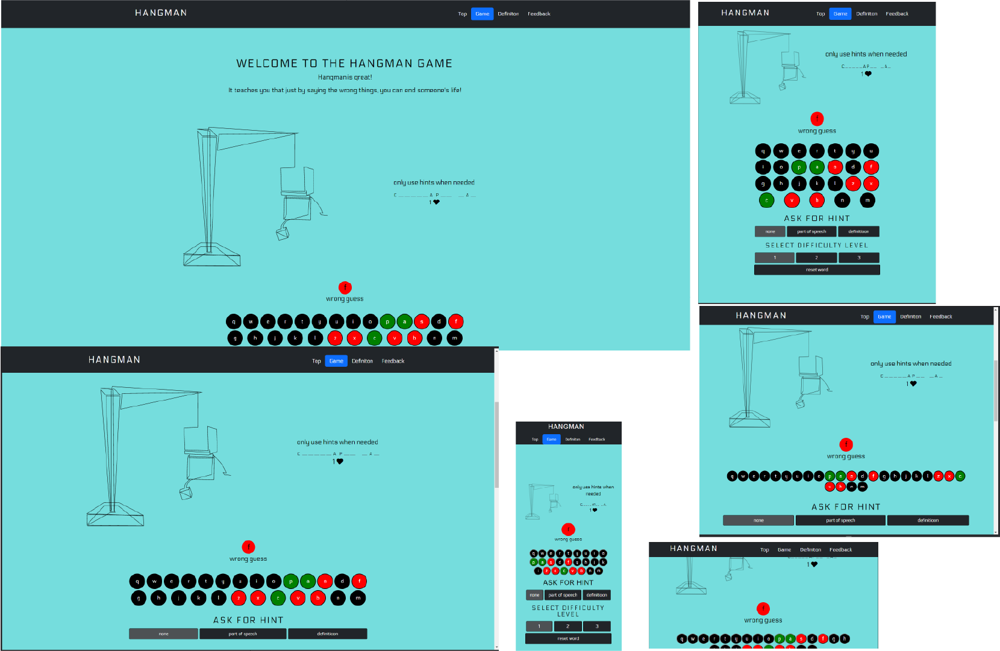
* Web-large
* web-small
* tablet-portrait
* tablet-landscape
* phone-portrait
* phone-landscape

## Features

 # the website has only one page
  ## ELEMENTS: 

 ## Navigation Bar
 - elements:
    - Logo
    - 4 buttons linked to a bootstrap scrollspy class 
 
 ## Footer
- elements:
    - Heading
    - 4 mooving icons(Lottie Animations) illustrating the social media links to Facebook, Instagram, youtube, liked-in.  
      these are free animations downloaded from [lottie-files.com](https://lottiefiles.com/) 
  
  

 ## Sections:
  - ## Introductory-section
        a heading and a funny message about the Hangman Game
  - ## Game-section
    - ### Features and functionality
            - when the user makes a mistake, the hangman animation starts to render a chunk, 
            this is an interractive animation that renders acording to the current state of the game
            - 3 difficulty levels 
            - 2 types of hint options
            - keypad for interracting with the game
            - letter feedback 
            - when the user guesses the letter 3 times in a row the user gets a live back with a 
            feedback message 
    - ### IF the game is over it will have one of the two states: failed or won, both will show a restart game button        
     
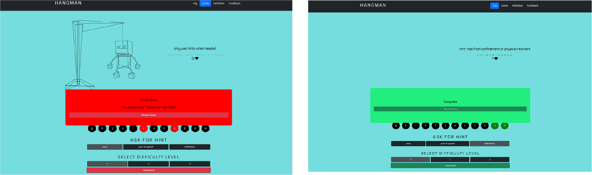

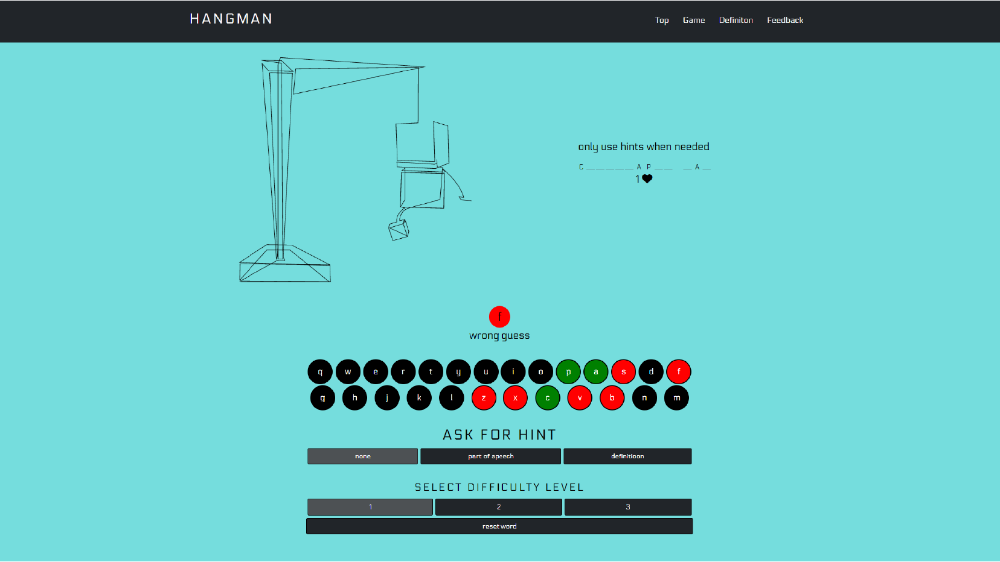
- ###  Hangman Animation 
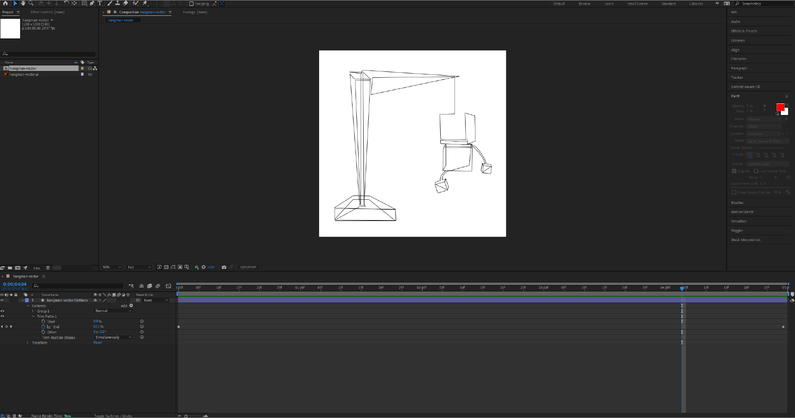
  - ## Collapsing wikipedia-iframe-section
        - a wikipedia iframe that get's activated once the user wins or fails the game, to provide more information about the word puzzle if needed
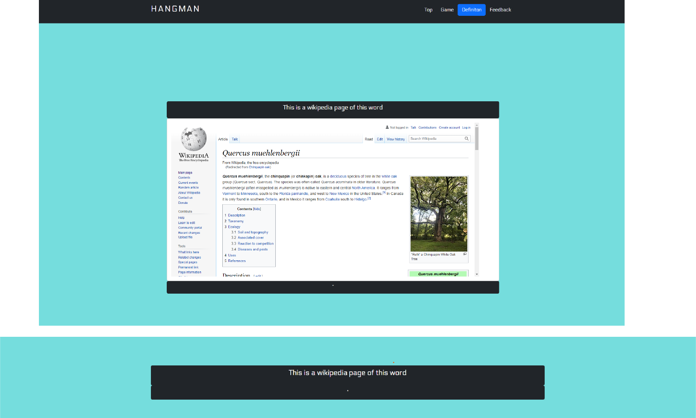
  - ## Feedback-section
        - a feedback form wired to the emailjs service.
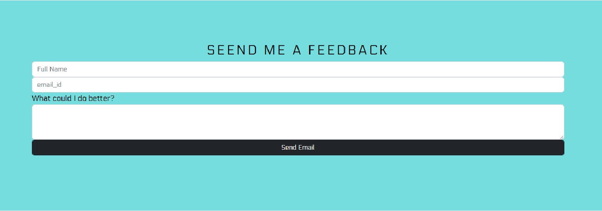

*  # Responsiveness
   ## the project uses Bootstrap and 1 css document: style.css 
         
   ## media queryes used throughout the project: 
    <table>
    <tr>
    <td>@media screen and (max-width:700px) </td>
    <td>style.css</td>
    </tr>
    <tr>
    <td>@media screen and (max-width:450px) </td>
    <td>style.css</td>
    </tr>
    <td>@media screen and (max-height: 1000px) </td>
    <td>style.css</td>
    </tr> 
    </table>
 
 # Whire Frame
  Figma was used as a whire-frame
  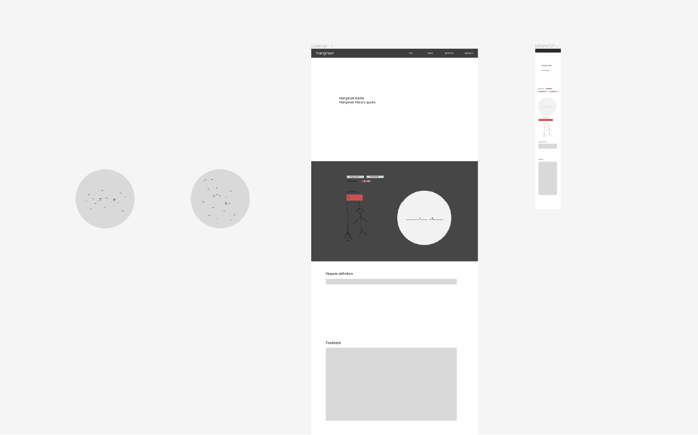 
  it served it's purpose in the beginning of the project to map-out features and ideas
  -         MENTION: It would have suited me to use a wireframe for the JS code in the beginning

# Technoligies used
- HTML
- CSS
- BootStrap
- JavaScript
- [gsap-functions](https://greensock.com/showcase/)
- [emailjs](https://www.emailjs.com/)
- [Words Api](https://rapidapi.com/dpventures/api/wordsapi) through [rapidapi.com](https://rapidapi.com/hub)
- [LottieFiles - animations based on JSON files.](https://lottiefiles.com/)
- [Figma-design](https://www.figma.com/files/recent?fuid=722165586962807899)
- Adobe Illustrator   
- Adobe After Effects 

## Javascript code
- Files:
  -   api-requests.js
  -   app.js
  -   game-state.js
  -   hangman-lottie-animation.js
  -   prevent-default.js
  -   email-config.js
- Classes
  -   HangmanLottieAnimation
  -   GameState
      - They both become objects in app.js

## Testing
- light-house (I made sure to test the github hosted version, as it enables files-compression)
  - desktop and mobile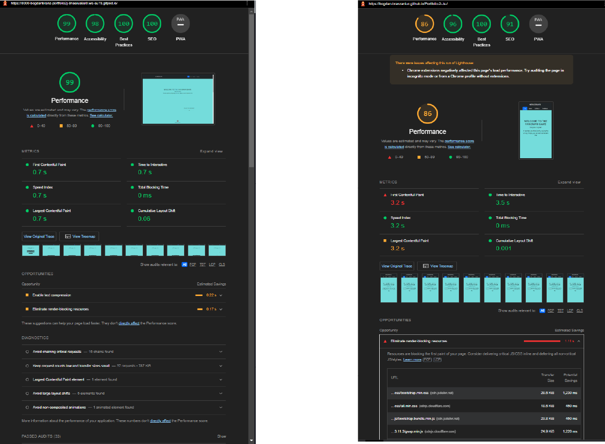
- [W3C Markup Validator](https://validator.w3.org/) :  [results](https://validator.w3.org/nu/?doc=https%3A%2F%2Fbogdan-branzaniuc.github.io%2FPortfolio-2-Js-%2F)
- [W3C CSS Validator](https://jigsaw.w3.org/css-validator/) :  [results](https://jigsaw.w3.org/css-validator/validator?uri=https%3A%2F%2Fbogdan-branzaniuc.github.io%2FPortfolio-2-Js-%2F&profile=css3svg&usermedium=all&warning=1&vextwarning=&lang=en)
- [JSHint](https://jshint.com/) 
  - results:
    - api-requests.js: 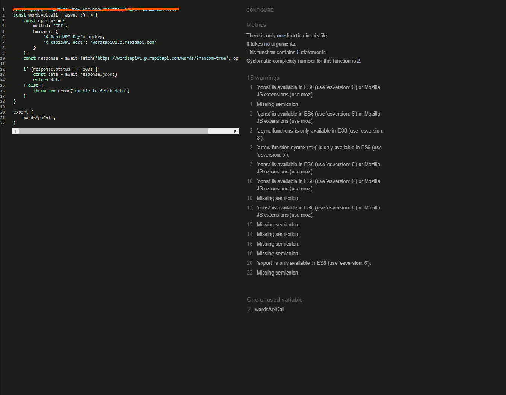 (although it's public in the code source, I covered the api-key for future reasons)
    - app.js: 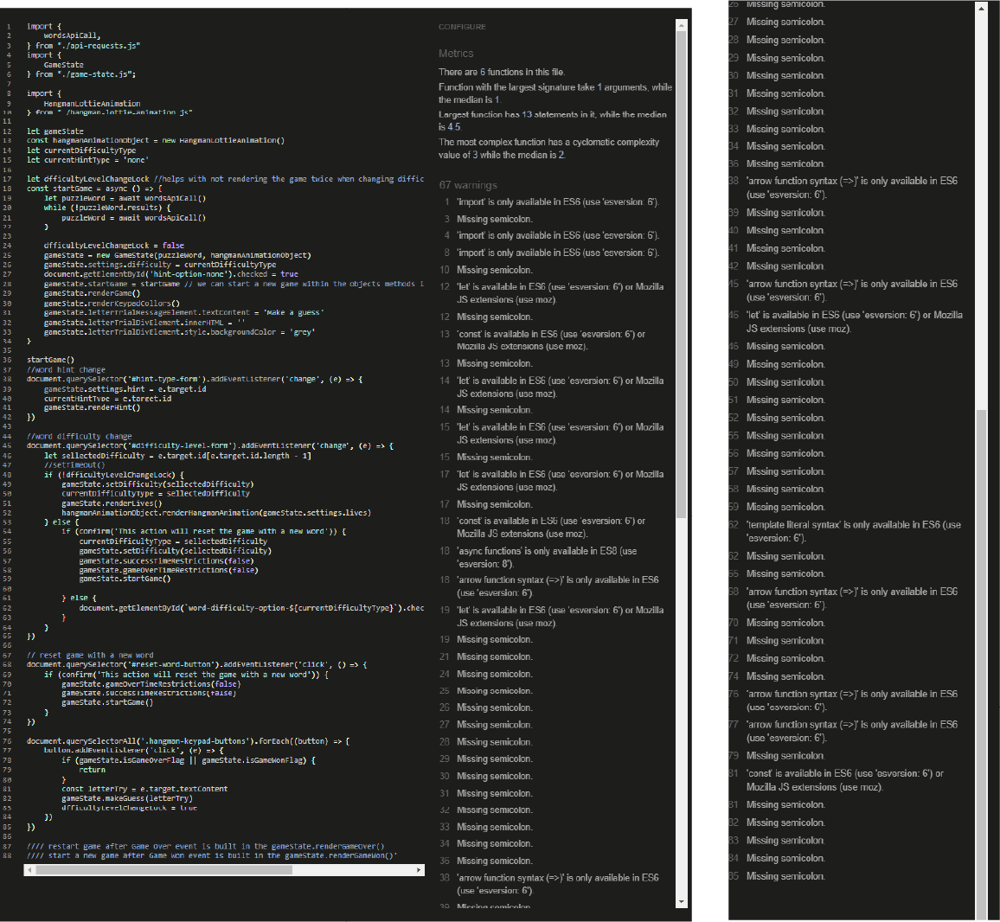
    - game-state.js: 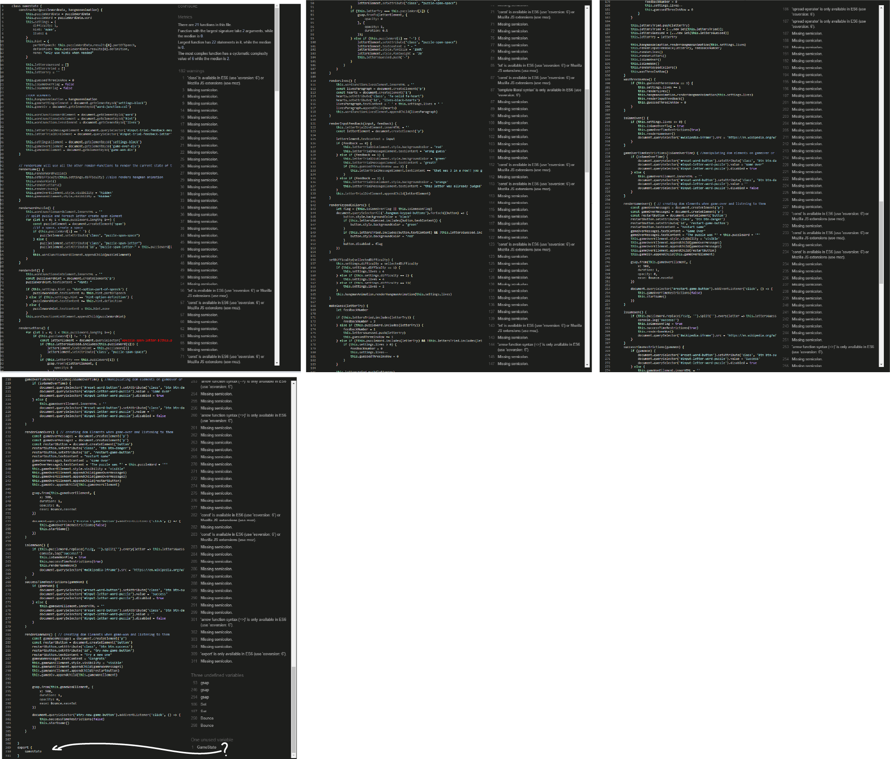 
    - hangman-lottie-animation.js: 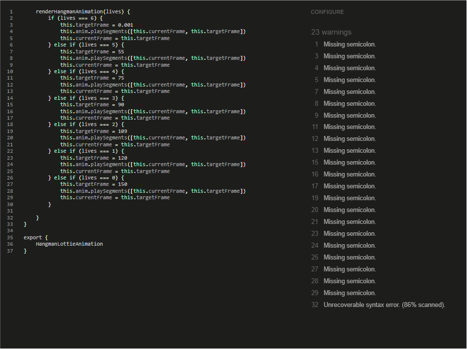 
    - prevent-default.js: 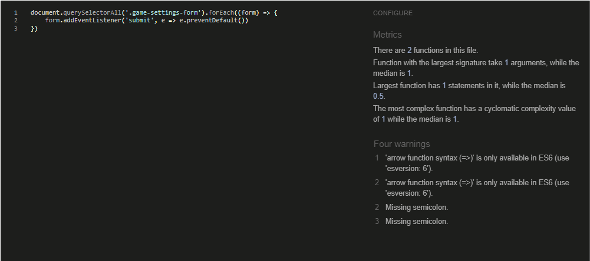 
    - email-config.js:  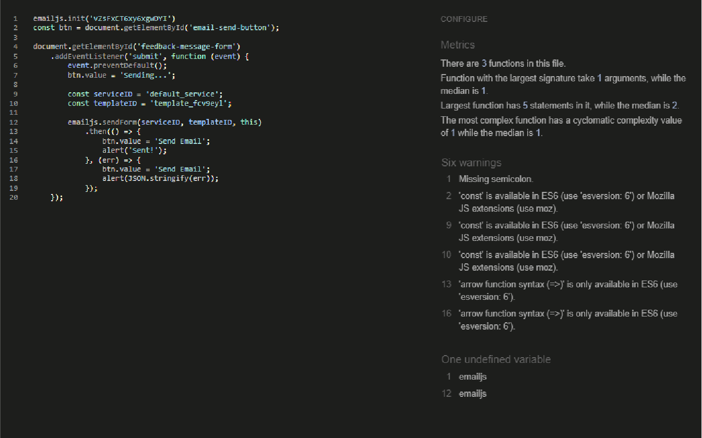 

- The website was viewed across multiple devices such as (large desktop(2560 x 1440 - 75hz), Android One Plus pro, iPhone X, G-series Dell Laptop)
- The game was sent to friends and relatives that really enjoyed breaking it and finding bugs, also playing it obsessively

  # current Bug
   - when or if the words api will call for a word that contains special characters, the programm will throw an error to the console, due to the way that gameState.renderWordPuzzle method gives an id to each span elements it creates. 
   - This bug was spotted too late to catch fix it in time
   - The solution is to create a method or independent function that builds the spaneElement-id attribute with a counting variable and then use the same routine to select and manipulate each DOM element in another part of the programm if needed

 
 
 
     

# Deployment
The project is deployed to Gihub pages

MENTION 
- I could have commited smaller chuncks of code and progress per commit, the bigger the chunk  the harder the naming, I ended up by omitting to name a huge part of the progress       

# Credits

## Code
 - All JS code in the js folder was written by the developer
 - All CSS code in style.css was written by the developer
 - The HTML code was written or copied by the developer while using bootstrap
 - The email-config.js file from config folder was copied from emailJS website

## Media                                                
- ### Lottie-files(animations) 
   - the interractive hangman-animation is created by the developer using Adobe Illustrator and After Effects then the extension Bodymovin provided by AE. 
   - the footer icons consists of Free animation files [lottiefiles.com](https://lottiefiles.com/)
- ### Icons
   - The black hearth icon that indicates the lives used throughout the project are from [fontawesome.com](https://fontawesome.com/)
- ### Images 
   - Images were only used for the readme file in the end, All of them rendered by the developer 

# Acknowledgements
    - My Mentor for valuable support and advice.
    - The Code Institute team, as they did a great job building the Course Programme.
    - Myself as I developed and grew while working on this project.
